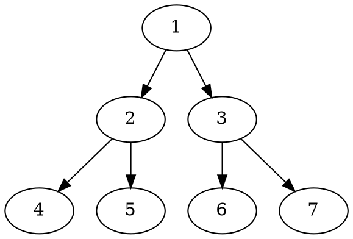
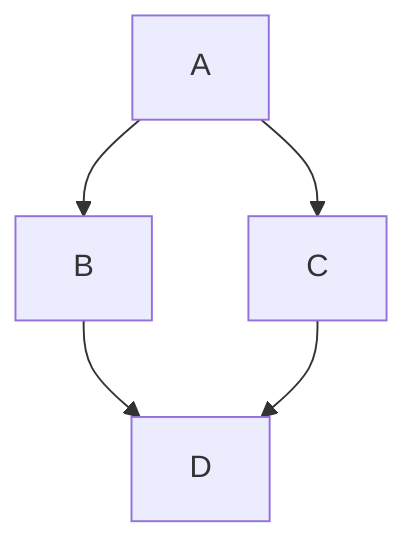
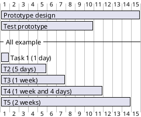

> test page ✌


```dot
digraph example1 {
    1 -> 2 -> { 4, 5 };
    1 -> 3 -> { 6, 7 };
}
```


```mermaid
graph TD;
    A-->B;
    A-->C;
    B-->D;
    C-->D;
```

```ditaa
+--------+   +-------+    +-------+
    |        | --+ ditaa +--> |       |
    |  Text  |   +-------+    |diagram|
    |Document|   |!magic!|    |       |
    |     {d}|   |       |    |       |
    +---+----+   +-------+    +-------+
        :                         ^
        |       Lots of work      |
        +-------------------------+
```


```plantuml
@startgantt
[Prototype design] requires 15 days
[Test prototype] requires 10 days
-- All example --
[Task 1 (1 day)] requires 1 day
[T2 (5 days)] requires 5 days
[T3 (1 week)] requires 1 week
[T4 (1 week and 4 days)] requires 1 week and 4 days
[T5 (2 weeks)] requires 2 weeks
@endgantt
```
