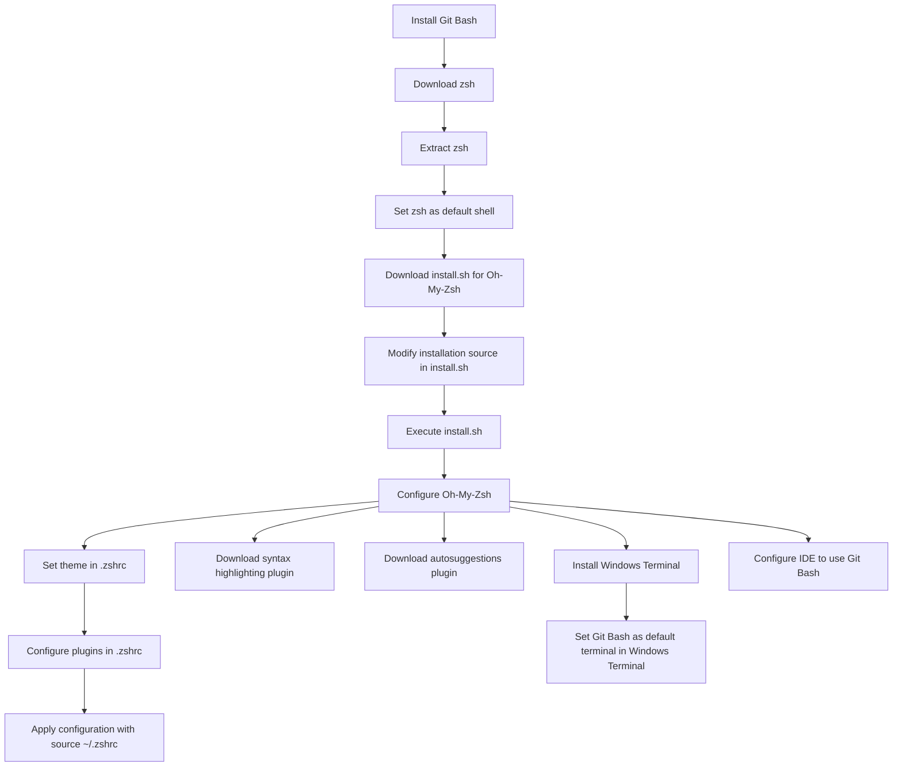

[[toc]]

Oh My Zsh enhances terminal usability in Unix environments. Here's a guide to configure it on Windows with Git Bash.



## Step 1: Install Git Bash

Download and install from the [Git website](https://git-scm.com/downloads).

## Step 2: Install zsh

### 1. Download zsh

- [Download zsh-5.9-2-x86_64.zip](https://grr.lanzouo.com/iIgdg21xqqfe)
- [Download from official source](https://packages.msys2.org/package/zsh?repo=msys&variant=x86_64)
- [Download extraction tool](https://peazip.github.io/)

### 2. Install zsh

Extract zsh and copy `etc` and `usr` directories to the Git installation directory (e.g., `C:\Program Files\Git`).

### 3. Set zsh as the Default Shell

Run `chsh -s $(which zsh)` or add the following to `~/.bashrc`:

```sh
if [ -t 1 ]; then
  exec zsh
fi
```

## Step 3: Install Oh-My-Zsh

### 1. Download `install.sh`

Run:

```sh
curl -# -O https://mirror.ghproxy.com/https://raw.githubusercontent.com/ohmyzsh/ohmyzsh/master/tools/install.sh
```

### 2. Modify Installation Source

Edit `install.sh`:

```sh
REPO=${REPO:-ohmyzsh/ohmyzsh}
REMOTE=${REMOTE:-https://mirror.ghproxy.com/https://github.com/${REPO}.git}
BRANCH=${BRANCH:-master}
```

### 3. Execute the Script

Run:

```sh
sh install.sh
```

## Step 4: Configure Oh-My-Zsh

### 1. Set Theme

Edit `~/.zshrc` to change `ZSH_THEME="robbyrussell"` to `ZSH_THEME="ys"`.

### 2. Install Plugins

Run:

```sh
git clone https://github.com/zsh-users/zsh-syntax-highlighting.git ${ZSH_CUSTOM:-~/.oh-my-zsh/custom}/plugins/zsh-syntax-highlighting
git clone https://github.com/zsh-users/zsh-autosuggestions ${ZSH_CUSTOM:-~/.oh-my-zsh/custom}/plugins/zsh-autosuggestions
```

### 3. Configure Plugins

Edit `~/.zshrc`:

```sh
plugins=(git zsh-syntax-highlighting zsh-autosuggestions)
```

### 4. Apply Configuration

Run:

```sh
source ~/.zshrc
```

## Step 5: Configure Windows Terminal

### Installation

Install from the Microsoft Store or [official documentation](https://learn.microsoft.com/zh-cn/windows/terminal/install).

### Configuration

Set Windows Terminal to default to Git Bash.

## Step 6: Configure IDEs (e.g., IDEA, VSCode)

Set the default terminal to Git Bash in the IDE settings.
