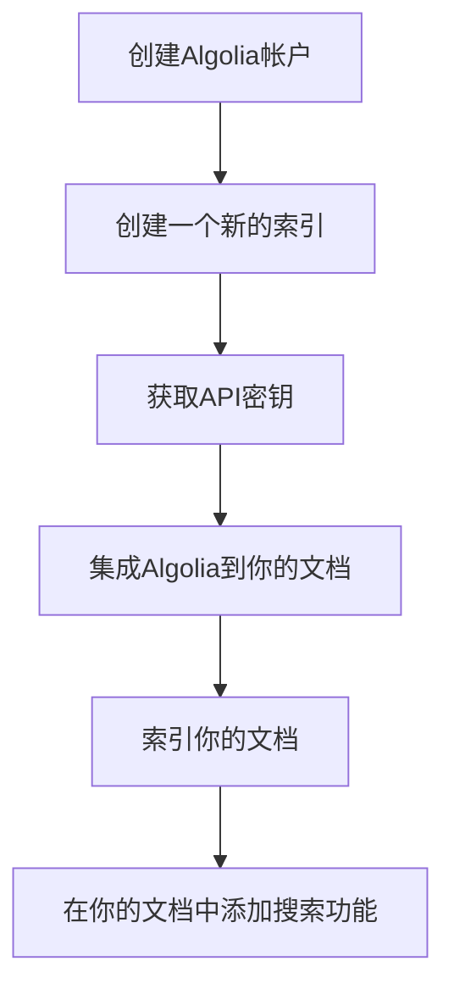

## 开始之前

在开始之前，请确保你有一个有效的Algolia帐户。如果没有，请先创建一个。

## 集成步骤



### 1.创建Algolia帐户

1. 访问 [Algolia官网](https://www.algolia.com/)。
2. 点击"Sign Up"注册，按照页面提示完成注册流程。

### 2.创建一个新的索引

1. 登录你的Algolia帐户。
2. 导航到"Indices"页面，点击"Create Index"。
3. 给你的索引起一个名字，并确认创建。

### 3.获取API密钥

1. 在Algolia仪表盘中，点击"API Keys"。
2. 记录下你的`Application ID`、`Search-Only API Key`和`Admin API Key`。

### 4.集成Algolia到你的文档

集成方法取决于你文档的托管方式，这里我以我的文档为例，我使用了开源的DocSearch插件。

#### 集成DocSearch到Vue 3项目

1.申请DocSearch

在集成之前，你需要为你的文档申请DocSearch。访问 [DocSearch 申请页面](https://docsearch.algolia.com/apply/)，按照指示填写并提交表单。一旦你的申请被接受，Algolia 的团队将为你的文档创建一个索引，并发送给你一个唯一的 `API key` 和 `index name`。

2.安装DocSearch依赖

在你的Vue 3项目中，安装DocSearch的依赖。

```bash
pnpm install @docsearch/js@alpha
# 注意引用官方的组件，需要将样式依赖也安装好
pnpm install @docsearch/css
```

编写组件，可自定义也可直接使用DocSearch官方提供的组件。这里我借鉴[vitePress](https://github.com/vuejs/vitepress/blob/main/src/client/theme-default/components/VPAlgoliaSearchBox.vue)定义的AlgoliaSearch组件，下面展示为主要的代码

```vue
<script setup lang="ts">
import '@docsearch/css'
import docsearch from '@docsearch/js'
const props = defineProps<{
  algolia: AlgoliaSearchOptions
}>()

onMounted(() => {
  docsearch(algolia)
})
</script>

<template>
  <div id="docsearch" />
</template>
```

这里我使用的时候覆盖了原有的样式,如下

```vue
<template>
  <a href=" " class="relative">
    <div class="i-mynaui-search-square h-1.3em w-1.3em" />
    <AlgoliaSearchBox
      class="absolute left-0 top-0 h-full w-full op0!"
      :algolia="{
        apiKey: 'db0e9b82d77e75c9fc8aee05b1e14334',
        indexName: 'ryan',
        appId: 'X0NE0GCGVB',
      }"
    />
  </a>
</template>

<style>
:root {
  /* docsearch */
  --docsearch-primary-color: #313237 !important;
  --docsearch-logo-color: #313237 !important;
  --docsearch-text-color: #9d9fa1 !important;
}

.cls-1,
.cls-2 {
  fill: #060606 !important;
}

.DocSearch-Button-Placeholder,
span.DocSearch-Button-Keys {
  display: none;
}

button.DocSearch-Button {
  margin: 0;
  background: transparent;
  height: auto;
  padding: 0;
}

button.DocSearch-Button:active,
button.DocSearch-Button:focus,
button.DocSearch-Button:hover {
  background: transparent;
  box-shadow: none;
  color: var(--c-hover-color);
}
</style>
```

### 5.编写爬虫的规则

[爬虫规则](https://github.com/ryanuo/docs-crawler)
