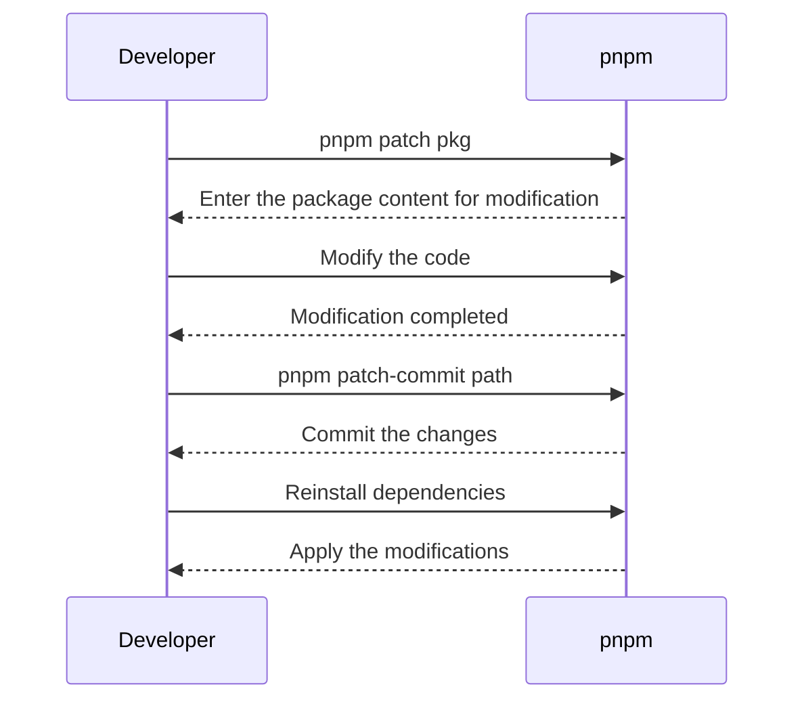

[[toc]]

### Patching with pnpm

Patching is an essential skill in front-end development, allowing you to modify the code of third-party libraries.

### Why Patching is Necessary

In project development, we often use third-party libraries. While most third-party libraries are reliable, they may still contain bugs or require optimization. Common ways to address issues in third-party libraries include:

- Replacing the library: However, the new library may not necessarily be better than the original one;
- Submitting an issue: Waiting for the author to respond, which may not be feasible when time is tight;
- Submitting a PR: The author may not merge it immediately;
- Patching: Making local modifications that only affect our project without waiting for the author's review.

### Using pnpm for Patching

Compared to yarn and npm, pnpm natively supports patching without requiring additional libraries. The specific steps are as follows:

1. Use `pnpm patch pkg` to enter the content of the package for modification;
2. After modifying the code, use `pnpm patch-commit path` to commit the changes;
3. Once completed, reinstall the dependencies, and pnpm will automatically read the content from the patch folder.

For example, when using a third-party library, suppose a specific function or method in the library contains a bug or does not meet our requirements. In this case, we can use patching to modify it. Assume we are using a third-party library called `awesome-library` in our project, but its function `doSomething()` has a bug that prevents our application from working properly. To resolve this issue, we can use pnpm's patching feature as follows:

1. First, use the command `pnpm patch awesome-library` to enter the content of the `awesome-library` package for modification.
2. Locate and fix the bug in the `doSomething()` function.
3. Commit the changes using the command `pnpm patch-commit path`.
4. Once completed, reinstall the dependencies, and pnpm will automatically read the content from the patch folder and apply our modifications.

In this way, we can fix or optimize issues in the library to meet the needs of our project without affecting the original library.

### Summary

Patching is an effective way to address issues in third-party libraries and improve front-end development efficiency. By patching, we can quickly fix problems without waiting for the author's response.
