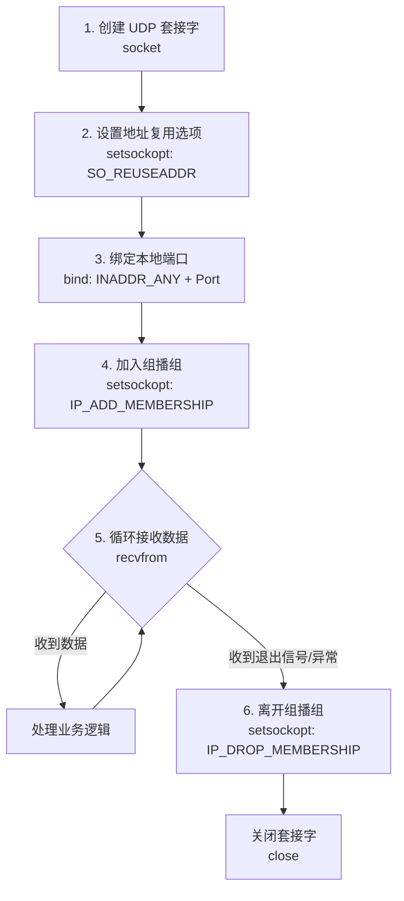
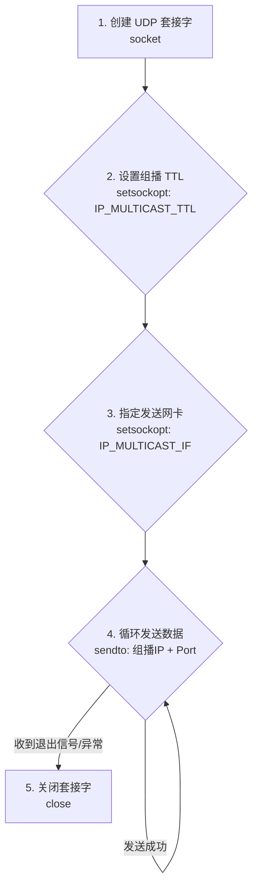

[[toc]]

# IPC 通讯

> 目的：数据传输、进程间控制、进程同步、事件通知

## 1. 管道

- (匿名管道，命名管道，标准流管道)

**匿名管道（PIPE）**<br/>
- 核心定义：匿名管道是一个没有名字（没有文件系统路径名）的内核级缓冲区。它通过文件描述符（fd[0] 为读端，fd[1] 为写端）进行访问。
- 通信限制：
    - 亲缘关系：仅适用于具有血缘关系的进程之间通信（如父子进程、兄弟进程）。
    - 单向通信：数据只能单向流动。若需双向通信，必须创建两个管道。
- 底层原理：父进程创建管道后调用 fork()，子进程会继承父进程的文件描述符表。父子进程通过读写指向同一个内核缓冲区的文件描述符来实现数据交互。
- 生命周期：随进程的结束而销毁。当所有读端或写端关闭时，管道会自动关闭。
- 核心 API：Linux: pipe(int fd[2])

**命名管道（FIFO）**<br/>
- 核心定义：命名管道（FIFO，First In, First Out）是一种特殊的文件类型。它在文件系统中拥有一个明确的路径名，但数据实际上驻留在内存中（没有 Data block，文件大小显示为 0）。
- 通信优势：
    - 无亲缘限制：任何具有访问权限的进程，只要知道管道的路径名，都可以打开它进行通信。
    - 持久性：即使创建它的进程退出，管道文件依然存在于文件系统中，直到被显式删除。
- 读写特性：
    - 本质上是半双工（单向）的，但可以通过创建两个命名管道来实现全双工通信。
    - 读写操作遵循严格的阻塞规则：如果写端关闭，读端读完数据后 read() 返回 0；如果读端全部关闭，写端继续写入会触发 SIGPIPE 信号。
- 核心 API：
    - 命令行创建: mkfifo filename
    - C语言创建: mkfifo(const char *pathname, mode_t mode)

**标准流管道**<br/>

- 核心定义：这是一种基于标准 I/O 文件流（FILE *）的管道机制，主要用于创建一个连接到另一个可执行程序（如 Shell 命令）的管道。
- 工作流封装：它将创建管道、fork() 子进程、关闭不需要的文件描述符、调用 exec 函数族执行命令等一系列复杂操作，高度封装在了一个函数中。
- 使用限制：
    - 必须使用标准 I/O 函数（如 fgets, fputs）进行操作，不能使用底层的 read/write。
    - 关闭时必须使用对应的 pclose() 函数，它会关闭流并等待命令执行结束。
- 核心 API：
    - 创建: FILE*popen(const char *command, const char*type) （type 为 "r" 或 "w"）
    - 关闭: int pclose(FILE*stream)

**核心对比总结**<br/>
| 对比维度 | 匿名管道 (Anonymous Pipe) | 命名管道 (Named Pipe / FIFO) | 标准流管道 (Standard Stream Pipe) |
| :--- | :--- | :--- | :--- |
| 通信范围 | 受限：仅限具有亲缘关系的进程（如父子、兄弟进程）。 | 广泛：支持任意进程间通信，只要知道路径名且有权限。 | 广泛：通常用于与另一个程序（子进程）进行通信，支持任意可执行程序。 |
| 通信方向 | 单向：半双工。若需双向通信，必须建立两个管道。 | 单向/双向：本质半双工，但可通过建立两个命名管道实现全双工。 | 单向：通常是单向的（`popen` 模式决定是读还是写），双向较复杂。 |
| 操作接口 | 底层 I/O：使用文件描述符 (`int fd`)，配合 `read()` / `write()` 系统调用。 | 底层 I/O：使用文件描述符 (`int fd`)，配合 `read()` / `write()` 系统调用（也可用标准 I/O 封装）。 | 标准 I/O：使用流指针 (`FILE *fp`)，配合 `fgets()` / `fputs()` / `fprintf()` 等库函数。 |
| 生命周期 | 临时性：随进程结束而销毁，存在于内存中，无文件系统路径。 | 持久性：作为特殊文件存在于文件系统中，直到被显式删除（`unlink`）。 | 临时性：随 `pclose()` 调用或程序结束而关闭，底层依赖匿名管道。 |
| 创建方式 | 系统调用 `pipe(int fd[2])` | 命令行 `mkfifo` 或系统调用 `mkfifo()` | 标准库函数 `popen(const char *command, const char *type)` |


## 2. 共享内存

- 共享内存（Shared Memory）是`最快`的进程间通信（IPC）机制。它允许多个不相关的进程直接访问同一块物理内存区域，从而实现“零拷贝”（Zero-Copy）通信。

**1. 共享内存的分类**

- `System V 共享内存`：历史较悠久，通过 shmget、shmat 等函数族进行操作，生命周期由内核管理，支持跨进程持久化。
- `POSIX 共享内存`：较新的标准，通过 shm_open 和 mmap 进行操作，与文件系统路径结合更紧密，API 设计更符合现代 POSIX 规范。

**2. System V 共享内存核心 API**
- 申请/创建内存映射 (shmget)：
    - 作用：创建一个新的共享内存段，或获取一个已存在的共享内存段。
    - 原型：int shmget(key_t key, size_t size, int shmflg);
- 连接/附加共享内存 (shmat)：
    - 作用：将共享内存段附加（映射）到当前进程的虚拟地址空间。成功后，进程可以通过返回的指针像操作普通内存一样直接读写数据。
    - 原型：`void *shmat(int shmid, const void*shmaddr, int shmflg)`;
- 断开共享内存 (shmdt)：
    - 作用：将共享内存段从当前进程的地址空间中分离。注意：这仅仅是解除映射，并不会从系统中删除该共享内存。
    - 原型：`int shmdt(const void *shmaddr)`;
- 共享内存回收与控制 (shmctl)：
    - 作用：对共享内存段执行各种控制操作。
- 核心命令参数：
    - `IPC_RMID`：删除/销毁共享内存段（释放物理内存资源）。
    - `IPC_STAT`：获取共享内存段的当前属性状态。
    - `IPC_SET`：设置共享内存段的属性（如权限、所有者等）。

**3. 同步机制与信号量操作规范**

- 由于共享内存没有内置的同步和互斥机制，多个进程并发读写极易导致数据竞争（脏读、写覆盖等），因此必须配合信号量（Semaphore）等机制使用。
- P 操作（等待/申请资源）：
    - 规范：必须考虑设置 `SEM_UNDO` 标志。
    - 原因：如果持有锁的进程在 P 操作之后、V 操作之前意外崩溃，内核会在进程退出时自动撤销（Undo）该 P 操作，从而释放信号量，防止死锁和资源泄漏。
- V 操作（释放/释放资源）：
    - 规范：永远不要设置 `SEM_UNDO` 标志。
    - 原因：V 操作本身就是为了释放资源而设计的。如果进程在 V 操作前崩溃，P 操作的 SEM_UNDO 机制已经会自动补偿释放；若 V 操作也设置 SEM_UNDO，反而可能导致信号量被错误地多次释放，破坏同步状态。

## 3. 消息队列

- 一条消息队列，最大容量是 16384字节(16K)；一条消息最大长度为8192字节(8K).
>核心API与流程
- 生成键值 (ftok)：通过文件路径和项目ID生成一个唯一的 key_t 键值，用于标识消息队列。
- 创建/获取队列 (msgget)：根据键值创建新的消息队列或获取已存在的队列，需指定权限（如 IPC_CREAT | 0666）。
- 发送消息 (msgsnd)：将消息写入队列。消息结构体必须以 long mtype（消息类型，必须大于0）开头，后面跟着消息正文。
- 接收消息 (msgrcv)：从队列读取消息并自动将其从队列中删除。其最大特点是支持按类型过滤接收：
msgtyp = 0：按FIFO顺序接收第一条消息；msgtyp > 0：只接收指定类型的第一条消息；msgtyp < 0：接收类型值小于等于其绝对值的最小类型消息。
- 控制队列 (msgctl)：用于删除队列（IPC_RMID）、获取状态信息（IPC_STAT）或修改权限（IPC_SET）。
>开发避坑指南
- System V 的残留问题：System V 消息队列是随内核持续的，如果程序异常退出且未调用 msgctl(IPC_RMID) 删除队列，消息队列会残留在系统中。需使用 ipcs -q 查看并用 ipcrm -q 手动清理。
- 内存泄漏防范：在自定义消息队列中，出队（mq_pop）后务必 free 掉消息体（body）、消息结构体（msg）以及队列节点（node），防止内存泄漏。
- 销毁队列的规范：销毁内存队列时，不仅要销毁互斥锁和条件变量，还要遍历链表释放所有残留的消息节点。

## 4. 信号量

- 本质：Dijkstra 提出的整数计数器，通过原子操作解决并发竞态条件，控制共享资源访问。
- 核心操作（PV 原语）：
    - P 操作（Wait/Down）：S减1。若 S < 0，进程阻塞入队；若 S >= 0，继续执行。
    - V 操作（Signal/Up）：S加1。若 S <= 0，唤醒队列中-
一个进程；若 S > 0，继续执行。
- 分类：
    - 二进制信号量：值为 0 或 1，用于互斥（保护临界区）。
    - 计数信号量：值为非负整数，用于同步（控制 N 个同类资源的并发访问）。
- 与互斥锁区别：互斥锁有所有权（谁加锁谁解锁）；信号量无所有权（任何进程/线程均可 V 操作释放）。
- 核心 API（POSIX）：
    - 初始化：sem_init() / sem_open()
    - P操作：sem_wait()
    - V操作：sem_post()
    - 销毁：sem_destroy() / sem_close()

## 5. 信号

- 本质：软件层面的“中断”，用于通知进程异步事件（如 Ctrl+C 触发 SIGINT）。
- 生命周期：产生 → 未决（Pending，已产生但未处理） → 递达与处理。
- 阻塞机制：通过信号屏蔽字控制，被阻塞的信号停留在“未决”状态，解除阻塞后才递达。
- 处理方式：默认动作、忽略、自定义捕获函数（Handler）。
- 核心 API：
    - 注册：signal() / sigaction()
    - 发送：kill() / raise()
    - 阻塞/未决：sigprocmask() / sigpending()
- 分类：标准信号（1-31，不可靠，不排队）；实时信号（32+，可靠，支持排队）。

## 6. 套接字

### UDP 协议

> UDP 单对单
- UDP实现点对点发送数据--`发送端`

1. 创建套接字socket
2. 设定接收方的地址信息(协议，ip, port)
3. 发送消息给接收端（sendto）
4. 收取接收方的响应数据(recvfrom)
5. 关闭套接字(close)

- UDP实现点对点接收数据--`接收端`

1. 创建套接字socket
2. 绑定自己的地址信息(bind)
3. 接收发送者发送过来的数据(recvfrom)
4. 可以给发送者响应数据(sendto)
5. 关闭套接字(close)

> 广播

- UDP协议---广播---`发送端`
1. 调用setsockopt函数，开启广播模式
2. 设置特殊的ip地址(广播地址)： 192.168.12.255  / 255.255.255.255 (INADDR_BROADCAST)
3. 广播的发送端只做发送

- UDP协议---广播---`接收端`
1. 广播的接收端是被动的，无需做修改
2. 接收端绑定的ip应该使用任何ip(0.0.0.0---INADDR_ANY)---推荐；接收端绑定当前主机所在ip网段的广播地址(192.168.x.255)，并且发送端必须给192.168.x.255地址发送数据，接收端才能收到；接收端绑定地址信息是不指定ip地址，让系统默认

>组播

```
224.0.0.0～224.0.0.255为预留的组播地址（永久组地址），地址224.0.0.0保留不做分配，其它地址供路由协议使用；
224.0.1.0～224.0.1.255是公用组播地址，可以用于Internet；
224.0.2.0～238.255.255.255为用户可用的组播地址（临时组地址），全网范围内有效；
239.0.0.0～239.255.255.255为本地管理组播地址，仅在特定的本地范围内有效。
```

**UDP实现组播--接收端**

- 组播地址范围：组播 IP 属于 D 类地址（224.0.0.0 ~ 239.255.255.255）。
建议：局域网测试推荐使用本地管理范围的私有组播地址 239.0.0.0 ~ 239.255.255.255，避免与公网真实组播流冲突。
- 接收端核心逻辑：接收端不关心发送端是谁，只需“加入”指定的组播组，操作系统内核会自动过滤并接收发往该组播 IP 和端口的数据包。

**核心实现步骤**
1. 创建 UDP 套接字 -> socket
2. 设置地址复用选项 -> setsockopt--SO_REUSEADDR
3. 绑定本地端口 -> bind
4. 加入组播组 -> setsockopt--IP_ADD_MEMBERSHIP
5. 接收数据 -> recvfrom
6. 离开组播组 -> setsockopt--IP_DROP_MEMBERSHIP

`标准跨平台` struct ip_mreq：通过 IP 地址指定网卡。

```c
struct ip_mreq mreq;
mreq.imr_multiaddr.s_addr = inet_addr("239.1.2.3"); // 组播组 IP
mreq.imr_interface.s_addr = htonl(INADDR_ANY);      // 默认网卡
```

`Linux 专属` struct ip_mreqn：支持通过网卡名称获取索引（imr_ifindex），在多网卡环境下更精确。

```c
struct ip_mreqn mreqn;
mreqn.imr_multiaddr.s_addr = inet_addr("239.1.2.3");
mreqn.imr_address.s_addr = htonl(INADDR_ANY);
mreqn.imr_ifindex = if_nametoindex("ens33"); // 通过网卡名获取索引
```

**流程图**



**UDP实现组播--接收端**

- 组播地址范围
与接收端一致，发送端也应使用 D 类地址（224.0.0.0 ~ 239.255.255.255）。局域网测试推荐使用私有组播地址 239.0.0.0 ~ 239.255.255.255。

**核心实现步骤**
- 创建 UDP 套接字 -> socket
- 设置组播 TTL (可选) -> setsockopt(IP_MULTICAST_TTL)，限制组播包跨越的路由器跳数（默认通常为 1，仅限本地网段）。
- 指定发送网卡 (可选) -> setsockopt(IP_MULTICAST_IF)，在多网卡环境下指定从哪个网卡发出组播包。
- 发送数据 -> sendto，目标地址为组播 IP 和端口。
- 关闭套接字 -> close

**流程图**



### TCP 协议

**服务器端**

1. 创建套接字
2. 绑定地址和端口
3. 监听客户端连接 ---> listen<br/>
**backlog** 是指允许的连接数，当客户端发起连接请求而服务器正忙于处理其他任务时，新到达的连接请求会被暂存在一个队列中等待处理，这个队列就是 backlog。它指定了该未完成连接队列的最大长度。
```
普通 Web 服务（如 Nginx/PHP-FPM）：通常设置为 1024 ～ 2048 即可满足大部分需求。
短连接高频服务（如 API 网关、HTTP 负载均衡）：由于连接建立频繁且速度快，建议设置为 1024 ～ 4096。也可以根据公式估算：峰值 QPS × 平均连接建立耗时(秒)。
高并发/长连接服务（如 WebSocket、IM 服务、Swoole）：由于并发量大，建议设置为 8192 ～ 16384 甚至更高。
```
4. 接受客户端连接 ---> accept
5. 接受客户端信息 ---> recv
6. 发送数据给客户端 ---> send
7. 关闭连接 ---> close