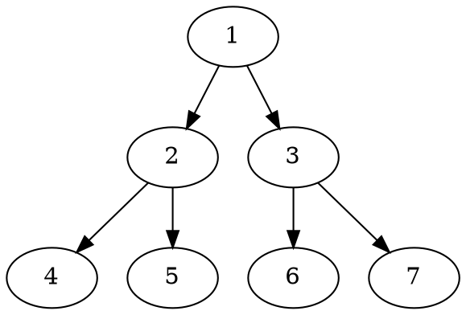

| [![npm version][npm-version-src]][npm-version-href] | [![npm downloads][npm-downloads-src]][npm-downloads-href] | [![bundle][bundle-src]][bundle-href] | [![JSDocs][jsdocs-src]][jsdocs-href] | [![License][license-src]][license-href] |
| --------------------------------------------------- | --------------------------------------------------------- | ------------------------------------ | ------------------------------------ | --------------------------------------- |

`markdown-it-diagram` 是一个用于在 Markdown 文档中创建图表的 `markdown-it` 插件。它支持 mermaid 和 plantuml，同时提供了如缩放、移动等控件功能。

[npm-version-src]: https://img.shields.io/npm/v/markdown-it-diagram?style=flat&colorA=080f12&colorB=5e5e5e
[npm-version-href]: https://npmjs.com/package/markdown-it-diagram
[npm-downloads-src]: https://img.shields.io/npm/dm/markdown-it-diagram?style=flat&colorA=080f12&colorB=5e5e5e
[npm-downloads-href]: https://npmjs.com/package/markdown-it-diagram
[bundle-src]: https://img.shields.io/bundlephobia/minzip/markdown-it-diagram?style=flat&colorA=080f12&colorB=5e5e5e&label=minzip
[bundle-href]: https://bundlephobia.com/result?p=markdown-it-diagram
[license-src]: https://img.shields.io/github/license/rr210/markdown-it-diagram.svg?style=flat&colorA=080f12&colorB=5e5e5e
[license-href]: https://github.com/ryanuo/markdown-it-diagram/blob/main/LICENSE
[jsdocs-src]: https://img.shields.io/badge/jsdocs-reference-080f12?style=flat&colorA=080f12&colorB=5e5e5e
[jsdocs-href]: https://www.jsdocs.io/package/markdown-it-diagram

## UML 示例

Markdown 支持：[plantuml](https://plantuml.com/)、[mermaid](https://github.com/mermaid-js/mermaid)、[dot](https://graphviz.gitlab.io/doc/info/lang.html)、[ditaa](https://ditaa.sourceforge.net/)

### PlantUML

[在线尝试](https://www.plantuml.com/plantuml/uml/)

````
```plantuml
Bob -> Alice : hello
```
````

```plantuml
Bob -> Alice : hello
```

### DOT

````

````


### ditaa

> **警告**: 在 PlantUML 中，仅支持生成 PNG,ASCII Art 图片。

````
```ditaa
+--------+   +-------+    +-------+
    |        | --+ ditaa +--> |       |
    |  Text  |   +-------+    |diagram|
    |Document|   |!magic!|    |       |
    |     {d}|   |       |    |       |
    +---+----+   +-------+    +-------+
        :                         ^
        |       Lots of work      |
        +-------------------------+
```
````

```ditaa
+--------+   +-------+    +-------+
    |        | --+ ditaa +--> |       |
    |  Text  |   +-------+    |diagram|
    |Document|   |!magic!|    |       |
    |     {d}|   |       |    |       |
    +---+----+   +-------+    +-------+
        :                         ^
        |       Lots of work      |
        +-------------------------+
```

### mermaid

````

````


## 安装

```bash
npm install markdown-it-diagram --save
```

## 使用方法

### Vite 配置

```ts
// vite.config.ts
import MarkdownItDiagrams from 'markdown-it-diagram'
import Markdown from 'unplugin-vue-markdown/vite'
export default defineConfig({
  plugins: [
    Markdown({
      markdownItSetup(md) {
        md.use(MarkdownItDiagrams, {
          showController: true, // show controller,default:false
          /**
           * PlantUML options
           * ditaa:imageFormat 'png| txt'
           * plantuml: imageFormat'png| svg| txt'
           * dot: imageFormat'png| svg| txt'
           */
          // imageFormat: 'svg', // image format:svg|png|txt,default:svg
          // server: '', // plantuml server,default:http://www.plantuml.com/plantuml
          // ditaa: {
          // imageFormat: 'svg', // image format:png|txt,default:svg
          // server: '', // plantuml server,default:http://www.plantuml.com/plantuml
          // }
        })
      }
    })
  ]
})
```

If you open the controller, you need to import the script in the initialization.
vue3 example:

```vue
<script setup lang="ts">
import { markdownItDiagramDom } from 'markdown-it-diagram/dom'
import { onMounted } from 'vue'
onMounted(async () => {
  // if you want to use mermaid, you need to install mermaid.js
  // npm install mermaid
  // import mermaid from 'mermaid'
  mermaid.initialize({ startOnLoad: false })
  await mermaid.run()
  // initialize markdown-it-diagram/dom script
  await markdownItDiagramDom()
})
</script>
```
