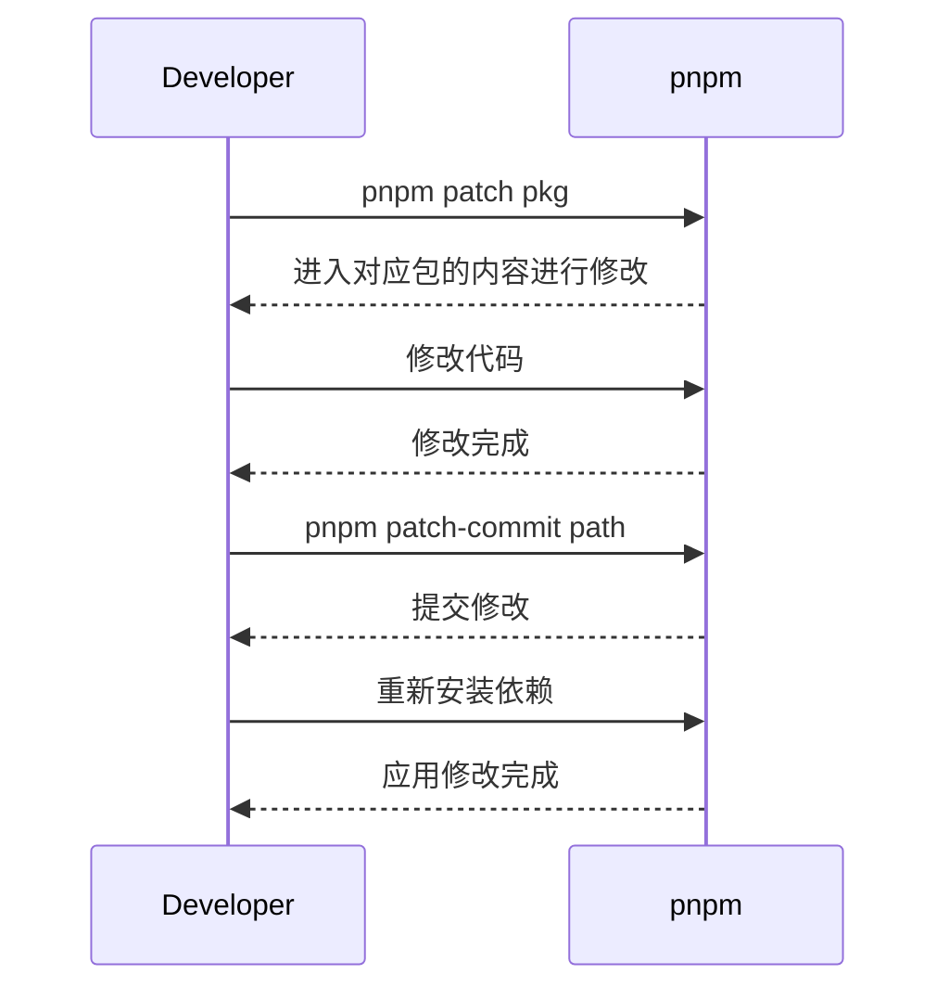

[[toc]]

### pnpm 打补丁

打补丁是前端开发中必备的技能之一，通过这种方式可以修改第三方库的代码。

### 为什么需要打补丁

在项目开发中，我们经常会使用第三方库。尽管大多数第三方库都很可靠，但仍然可能存在 bug 或需要优化的情况。因此，解决第三方库问题的常见方式包括：

- 更换库：但新库未必比原库更好；
- 提交 issue：等待作者回应，但时间紧迫时无法等待；
- 提交 PR：作者可能无法立即合并；
- 打补丁：本地修改，仅在我们的项目中生效，无需等待作者审核。

### 使用 pnpm 打补丁

相比于 yarn 和 npm，pnpm 默认支持打补丁功能，无需额外安装库。具体步骤如下：

1. 使用 `pnpm patch pkg` 进入对应包的内容进行修改；
2. 修改代码后，使用 `pnpm patch-commit path` 提交修改；
3. 完成后，重新安装依赖，pnpm 将自动读取 patch 文件夹下的内容。

例如，当使用一个第三方库时，假设该库中有一个特定的函数或方法存在 bug 或者不符合我们的需求，这时我们可以通过打补丁来修改它。假设我们在项目中使用了一个名为 `awesome-library` 的第三方库，但它的某个函数 `doSomething()` 存在一个 bug，导致我们的应用无法正常工作。为了解决这个问题，我们可以使用 pnpm 打补丁的方式进行修复：

1. 首先，使用命令 `pnpm patch awesome-library` 进入 `awesome-library` 包的内容进行修改。
2. 找到并修复 `doSomething()` 函数中的 bug。
3. 提交修改，使用命令 `pnpm patch-commit path` 来提交所做的更改。
4. 完成后，重新安装依赖，pnpm 将自动读取 patch 文件夹下的内容，并应用我们的修改。

通过这种方式，我们可以在不影响原始库的情况下，对其中的问题进行修复或优化，以满足我们项目的需求。

### 总结

打补丁是解决第三方库问题的有效方式，可以提升前端开发效率。通过打补丁，我们可以快速修复问题，而不必等待作者的响应。
