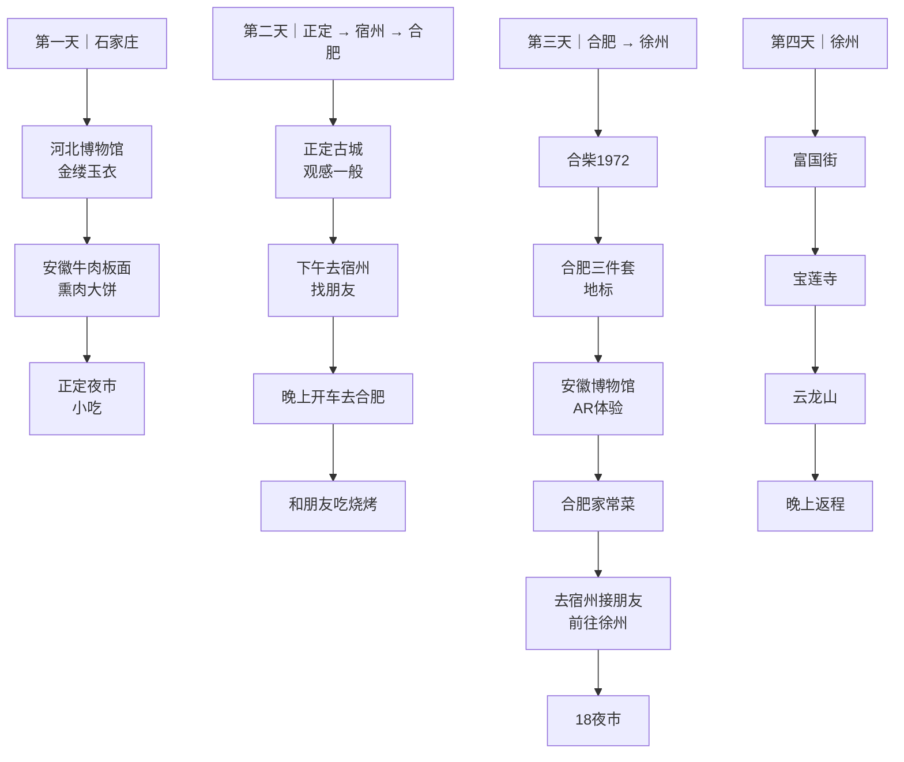
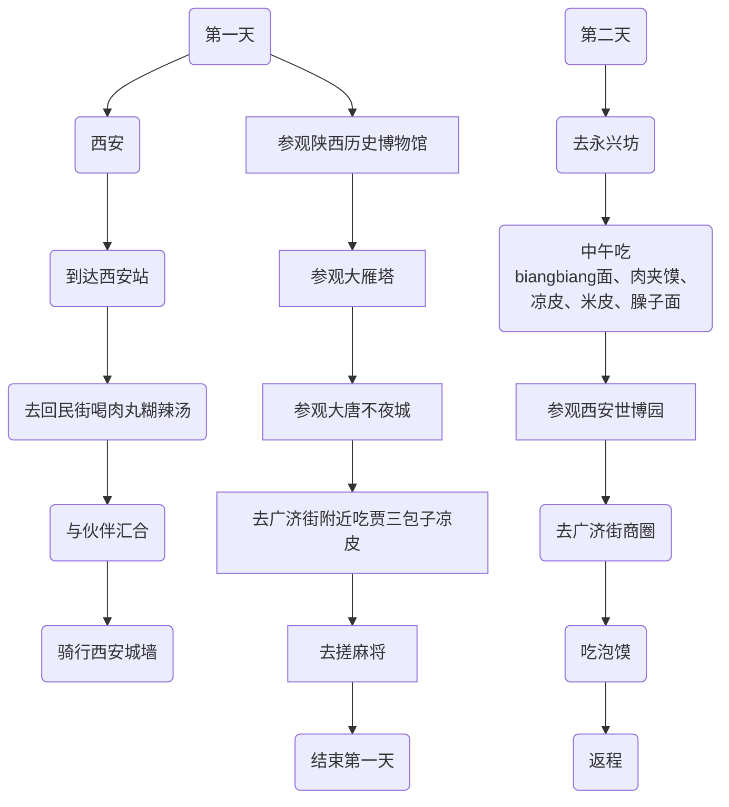

[[toc]]

### 2025-12-10 - 2025-12-15

这次行程从石家庄开始，第一天参观了河北博物馆，看了金缕玉衣，之后吃了正宗的安徽牛肉板面和熏肉大饼，晚上到正定夜市逛吃；第二天先去了正定古城，但整体感觉一般，下午前往宿州找朋友，晚上直接开车到合肥，和另一位朋友一起吃了烧烤；第三天在合肥游玩，去了合柴1972，打卡了合肥地标“三件套”，下午参观安徽博物馆并体验了 AR 游戏，晚上吃了合肥家常菜后又返回宿州接朋友，一起前往徐州，夜里逛了 18 夜市；第四天在徐州游览了富国街、宝莲寺和云龙山，晚上结束行程返回。

### 2024-05-18 - 2024-05-19

第一天到达西安站后，先去了回民街喝肉丸糊辣汤，随后与伙伴汇合，一起骑行了西安城墙，接着参观了陕西历史博物馆、大雁塔和大唐不夜城，晚上在广济街附近吃了贾三包子和凉皮，之后去搓麻将，结束第一天行程；第二天前往永兴坊，中午吃了 biangbiang 面、肉夹馍、凉皮、米皮和臊子面，下午参观西安世博园，傍晚到广济街商圈吃泡馍，随后返程。
