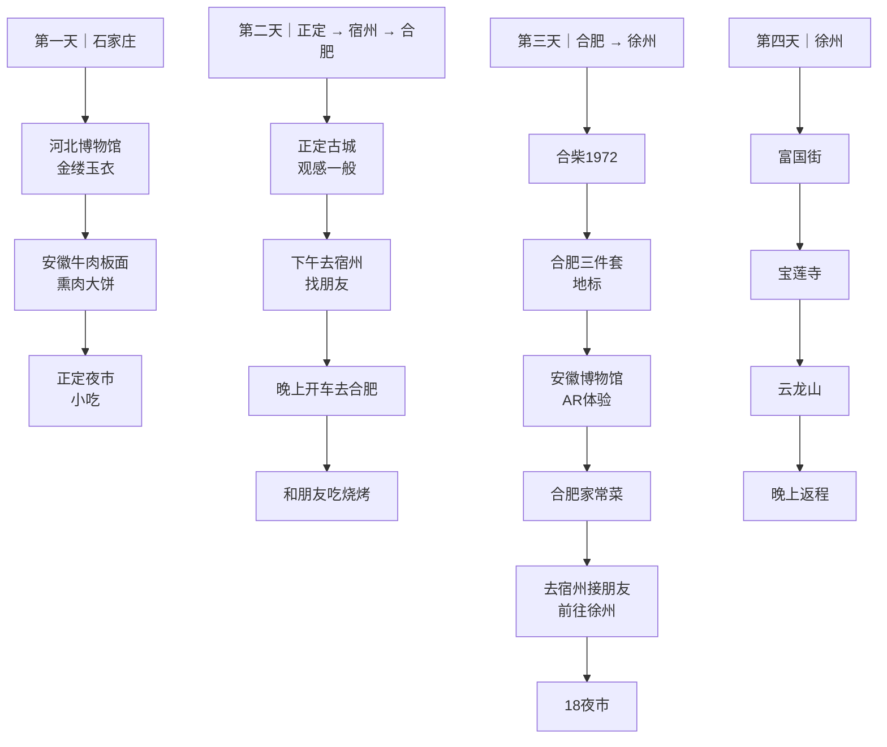
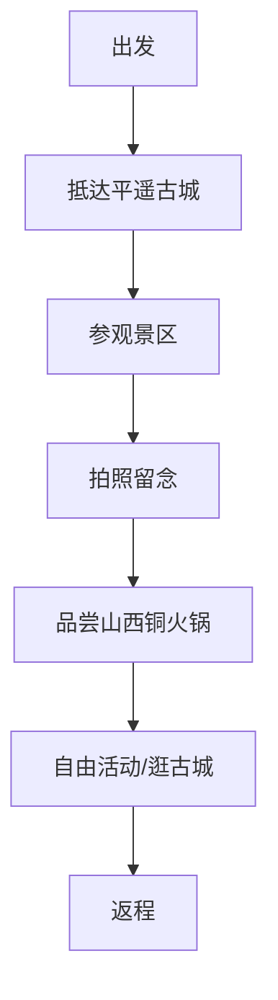
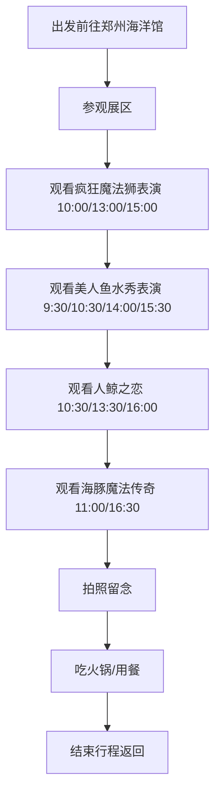
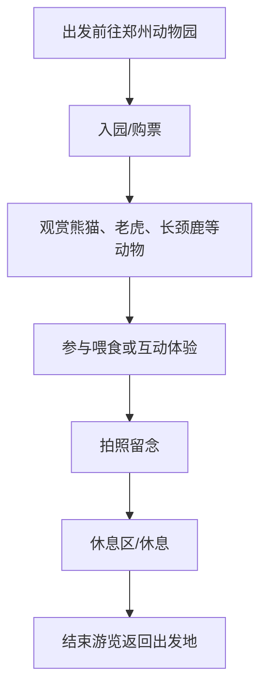
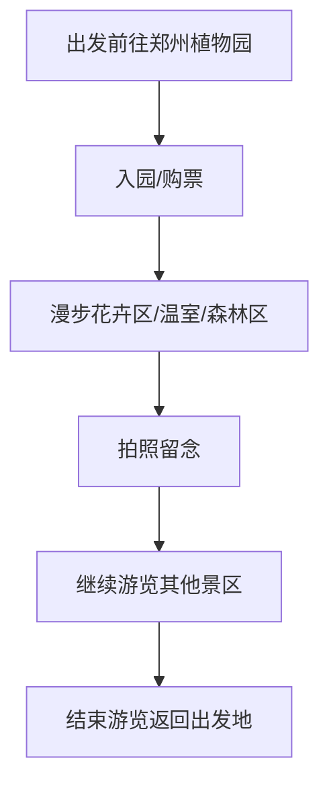
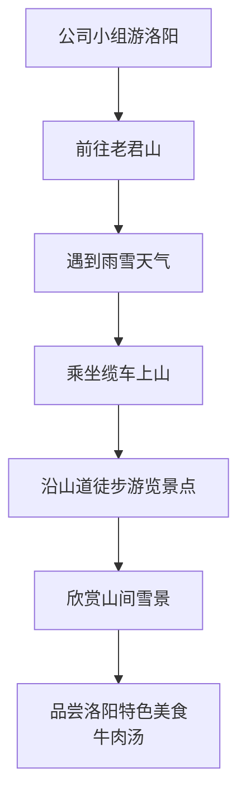
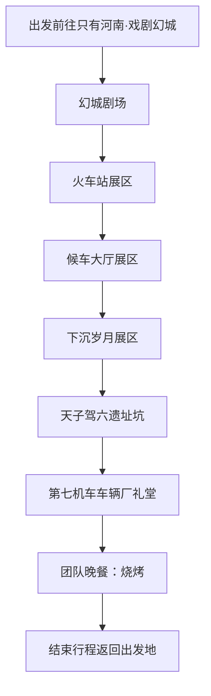
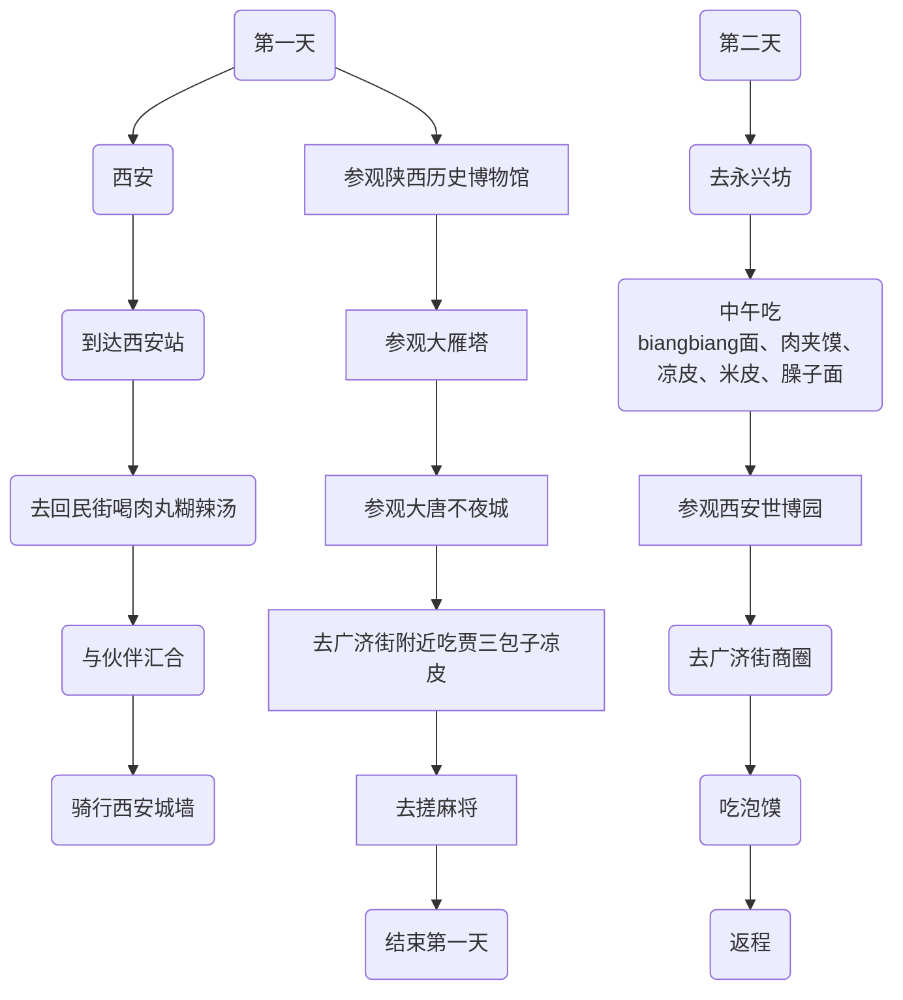
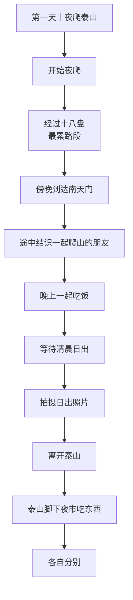
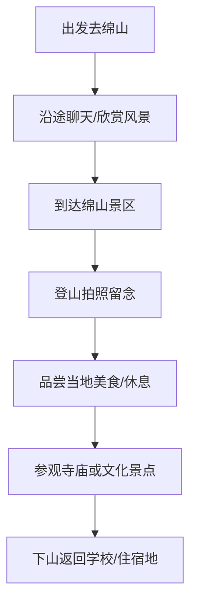

[[toc]]

### 2025-12-10 - 2025-12-15

这次行程从石家庄开始，第一天参观了河北博物馆，看了金缕玉衣，之后吃了正宗的安徽牛肉板面和熏肉大饼，晚上到正定夜市逛吃；第二天先去了正定古城，但整体感觉一般，下午前往宿州找朋友，晚上直接开车到合肥，和另一位朋友一起吃了烧烤；第三天在合肥游玩，去了合柴1972，打卡了合肥地标“三件套”，下午参观安徽博物馆并体验了 AR 游戏，晚上吃了合肥家常菜后又返回宿州接朋友，一起前往徐州，夜里逛了 18 夜市；第四天在徐州游览了富国街、宝莲寺和云龙山，晚上结束行程返回。

### 2025-11-14 - 2025-11-14

自驾前往平遥古城，抵达后在古城内漫步，参观城墙、日升昌票号等景点，拍摄古城建筑和街景照片。途中品尝山西特色铜火锅，感受当地美食魅力。随后在古城小街自由活动，逛手工艺品店或拍照留念，最后结束游览，自驾返回出发地。

### 2025-03-14 - 2025-03-15

当天前往郑州海洋馆，先参观各类海洋生物展区，体验互动展览。根据表演时间安排观看精彩节目：疯狂魔法狮、美人鱼水秀、人鲸之恋和海豚魔法传奇，并拍摄精彩瞬间留念。游览结束后，在馆内或附近餐馆享用火锅美食，结束愉快的一日海洋馆之行。

### 2024-12-28 - 2024-12-28

当天前往郑州动物园，沿园区步行游览，观赏熊猫、老虎、长颈鹿、大象等各类动物。途中在园内休息区或附近餐馆小憩，品尝简餐或零食。游览结束后，带着拍摄的照片和美好回忆返回出发地，结束愉快的动物园之行。

### 2024-12-22 - 2024-12-22

当天前往郑州植物园，漫步在花卉区、温室和森林区，欣赏各类植物和花卉景观。拍摄绿植和自然风光留念，感受园内宁静和自然氛围。

### 2024-11-24 - 2024-11-25

公司小组前往洛阳游览老君山，途中遇到雨雪天气，为了安全大家选择乘坐缆车上山。在缆车上和沿山道徒步游览过程中，大家欣赏到了山间的雪景和各个景点。游览结束后，品尝了洛阳的特色美食——牛肉汤。

### 2024-08-02 - 2024-08-02

小组团建当天前往 只有河南·戏剧幻城，团队依次参观沉浸式剧场和展区，包括 幻城剧场、火车站、候车大厅、下沉岁月、天子驾六遗址坑、以及 第七机车车辆厂礼堂。在各场景中观看精彩表演、体验互动展览，并拍摄团队合照留念。游览结束后，全体成员在附近享用烧烤晚餐，边用餐边分享当天趣事，增进团队感情。行程结束后返回出发地。

### 2024-05-18 - 2024-05-19

第一天到达西安站后，先去了回民街喝肉丸糊辣汤，随后与伙伴汇合，一起骑行了西安城墙，接着参观了陕西历史博物馆、大雁塔和大唐不夜城，晚上在广济街附近吃了贾三包子和凉皮，之后去搓麻将，结束第一天行程；第二天前往永兴坊，中午吃了 biangbiang 面、肉夹馍、凉皮、米皮和臊子面，下午参观西安世博园，傍晚到广济街商圈吃泡馍，随后返程。

### 2023-03-24 - 2023-03-25

第一天夜爬泰山，途中经过最累的十八盘，傍晚到达南天门，途中结识了几位一起爬山的朋友，晚上大家一起吃了饭，随后等待清晨的日出，并拍下了日出的照片。离开泰山后，大家在泰山脚下的夜市吃东西，最后各自分别。

### 2020-05-19 - 2020-05-20

大学期间与室友乘车前往绵山，沿途聊着校园趣事，气氛轻松愉快。到达绵山后，登山欣赏自然风光，拍摄山景和同伴合照，感受山间清新的空气。途中在山脚或山中小餐馆品尝当地美食，补充体力。参观寺庙或文化景点，感受绵山的历史与文化底蕴。傍晚下山，结束愉快的绵山之旅，返回学校或住宿地，途中回味旅途趣事和拍摄的照片。
