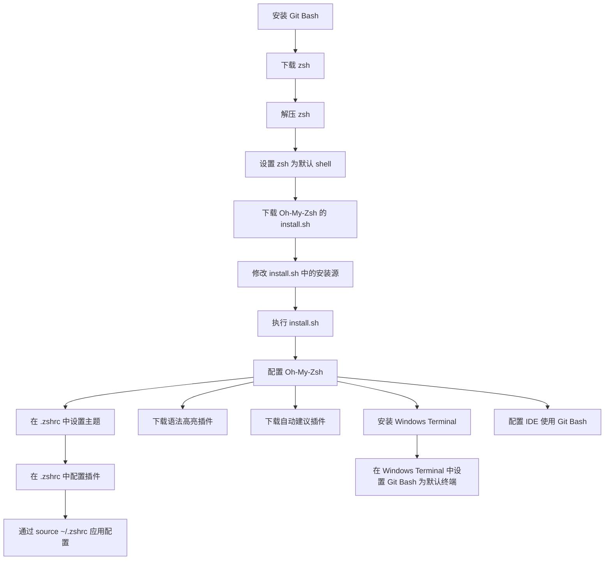

[[toc]]

在 Unix 环境中，Oh My Zsh 能极大提高终端易用性，并提供高度之定义功能。本文讲解在 Windows 下通过 Git Bash 配置 Oh My Zsh，实现让终端如在 Unix 环境下般便捷易用。



## 一、安装 Git Bash

从 Git 官网下载并安装 Git Bash。[下载地址](https://git-scm.com/downloads)

## 二、安装 zsh

### 1. 下载 zsh

- [下载 `zsh-5.9-2-x86_64.zip`](https://grr.lanzouo.com/iIgdg21xqqfe) 或从官方渠道下载最新版。
- [下载 zsh](https://packages.msys2.org/package/zsh?repo=msys&variant=x86_64)
- [下载解压软件](https://peazip.github.io/)

### 2. 安装 zsh

- 解压 zsh 包，将 `etc` 和 `usr` 目录复制到 Git 安装目录（如 `C:\Program Files\Git`）。

### 3. 设置 zsh 为默认终端

- 执行 `chsh -s $(which zsh)` 或在 `~/.bashrc` 中添加以下配置：

```sh
if [ -t 1 ]; then
  exec zsh
fi
```

## 三、安装 Oh-My-Zsh

### 1. 下载 `install.sh`

- 执行命令：

```sh
curl -# -O https://mirror.ghproxy.com/https://raw.githubusercontent.com/ohmyzsh/ohmyzsh/master/tools/install.sh
```

### 2. 修改安装源

- 编辑 `install.sh` 文件，将以下内容：

```sh
REPO=${REPO:-ohmyzsh/ohmyzsh}
REMOTE=${REMOTE:-https://github.com/${REPO}.git}
BRANCH=${BRANCH:-master}
```

修改为：

```sh
REPO=${REPO:-ohmyzsh/ohmyzsh}
REMOTE=${REMOTE:-https://mirror.ghproxy.com/https://github.com/${REPO}.git}
BRANCH=${BRANCH:-master}
```

### 3. 执行安装脚本

- 运行命令：

```sh
sh install.sh
```

## 四、配置 Oh-My-Zsh

### 1. 配置主题

- 修改 `~/.zshrc` 文件，将 `ZSH_THEME="robbyrussell"` 修改为 `ZSH_THEME="ys"`。

### 2. 下载常用插件

- 语法高亮插件：

```sh
git clone https://github.com/zsh-users/zsh-syntax-highlighting.git ${ZSH_CUSTOM:-~/.oh-my-zsh/custom}/plugins/zsh-syntax-highlighting
```

- 自动补全插件：

```sh
git clone https://github.com/zsh-users/zsh-autosuggestions ${ZSH_CUSTOM:-~/.oh-my-zsh/custom}/plugins/zsh-autosuggestions
```

### 3. 配置插件

- 修改 `~/.zshrc` 文件，将 `plugins=(git)` 修改为：

```sh
plugins=(git zsh-syntax-highlighting zsh-autosuggestions)
```

### 4. 使配置生效

- 执行命令：

```sh
source ~/.zshrc
```

## 五、配置 Windows Terminal

### 安装

- 从微软商店安装 Windows Terminal 或从官网下载安装包。
- [安装文档](https://learn.microsoft.com/zh-cn/windows/terminal/install)

- 配置 Windows Terminal 默认打开 Git Bash。

## 六、配置 IDE（如 IDEA、VSCode）

- 在对应 IDE 软件设置中配置默认终端为 Git Bash。
